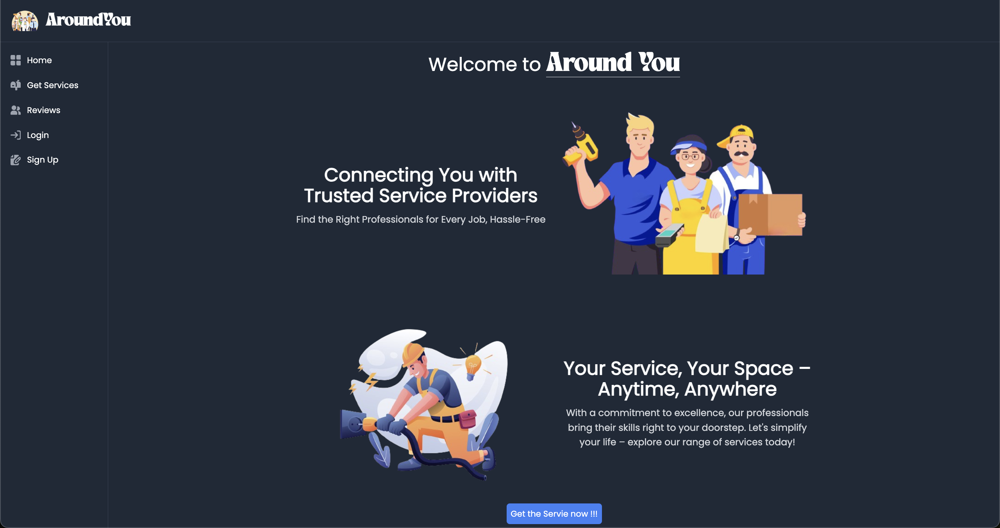
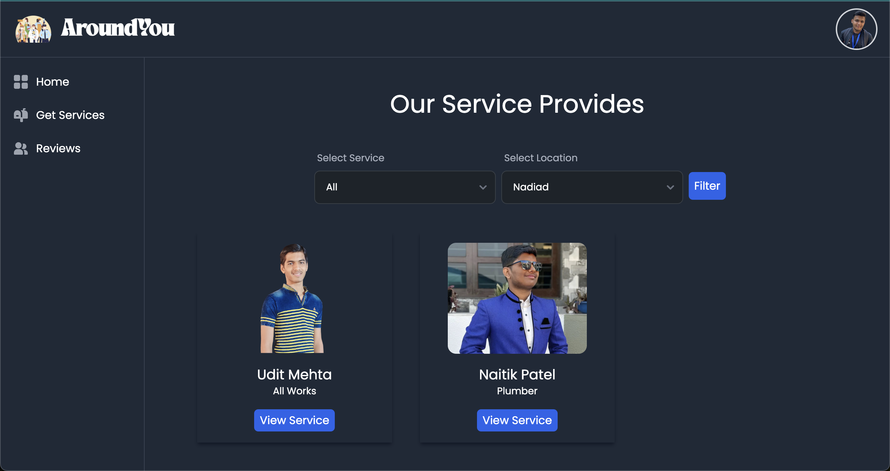
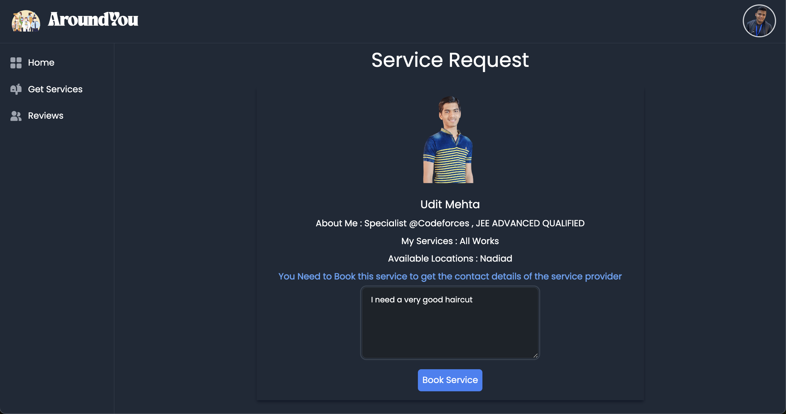
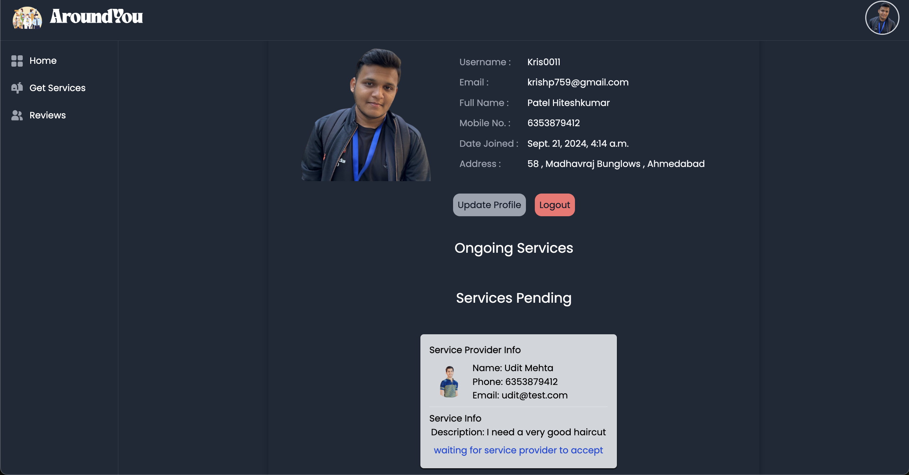

# AroundYou

Welcome to the AroundYou ! This platform aims to seamlessly connect users with service providers in their local areas. By leveraging the power of technology, we strive to enhance community engagement and simplify the process of discovering and accessing essential services.

## Technology Stack

- **Django:** High-level Python web framework. [Learn more](https://www.djangoproject.com/)
- **PostgreSQL:** Robust relational database hosted on Aiven cloud service. [Learn more](https://www.postgresql.org/)
- **Tailwind CSS:** Utility-first CSS framework for a sleek and responsive UI. [Learn more](https://tailwindcss.com/)
- **Cloudinary:** Cloud-based image and video management service. [Learn more](https://cloudinary.com/)
- **Vercel:** Deployment platform for hosting and managing the live application. [Learn more](https://vercel.com/)

## Preview

## Contributors
- Kris Patel
- Udit Mehta

## License

This project is licensed under the MIT License - see the [LICENSE](LICENSE) file for details.

